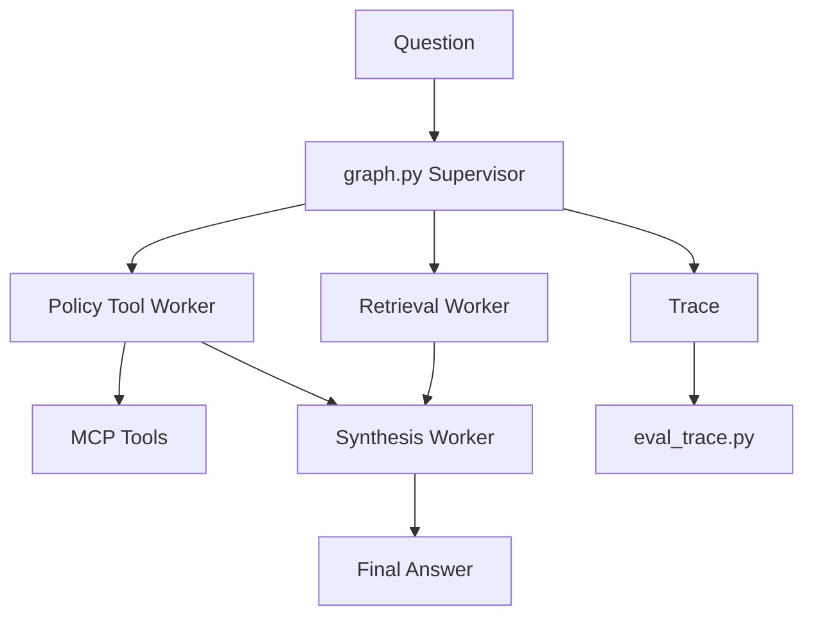

# System Architecture

## Overview

`Lab_Assignment` implements a deterministic Supervisor -> Workers -> Synthesis pipeline for Day 09. The design avoids API-key dependency by using local markdown policies, rule-based routing, Python-callable MCP tools, and rule-based synthesis fallback.

## Modules

- `graph.py` classifies the question, calls real workers, merges MCP usage, and returns the required grading fields.
- `workers/retrieval.py` loads `data/docs/*.md`, scores deterministic keyword matches, and returns chunks with filenames.
- `workers/policy_tool.py` handles conditional policies and calls `mcp_server.py` tools for access, refund knowledge-base search, and P1 ticket data.
- `workers/synthesis.py` creates concise cited answers and abstains when evidence is missing.
- `eval_trace.py` runs 15 evaluation questions and writes `artifacts/grading_run.jsonl` plus per-question traces.

## Trace Flow

Every graph result includes route, route reason, workers called, MCP tools used, confidence, and nested worker trace. `eval_trace.py` stores each trace as `artifacts/traces/<id>.json` so documentation and individual reports can cite real evidence.
