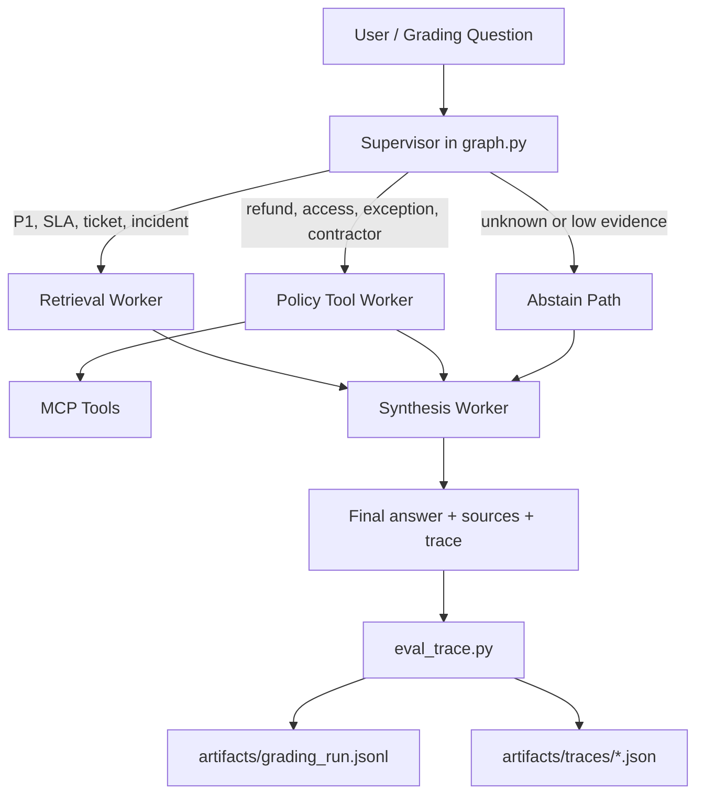

# Plan - Day 09 Multi-Agent MCP/A2A Maximum Score

## 1. Mục tiêu

Tạo lời giải trong thư mục `Lab_Assignment/` của repo gốc `longgoodboy/Day09_2A202600939_KieuDucLong`, chuyển bài Day 08/single-agent RAG thành hệ thống multi-agent theo mẫu `Supervisor -> Workers -> Synthesis`, có MCP tools, trace đầy đủ, tài liệu nộp bài và artifact `artifacts/grading_run.jsonl` đúng schema.

Mục tiêu điểm:

| Hạng mục | Mục tiêu |
|---|---:|
| Sprint Deliverables | 20/20 |
| Group Documentation | 10/10 |
| Grading Questions | 30/30 |
| Individual Report | 40/40 |
| Bonus | +5 nếu kịp MCP/trace tốt |

## 2. Phạm vi nộp bài

Repo gốc yêu cầu tạo thư mục mới `Lab_Assignment/` và đặt toàn bộ code assignment trong đó. Không đặt code assignment rải rác ngoài thư mục này. Root repo chỉ cần thêm `Lab-Solution.md` để giải phần lab trên lớp nếu chưa có.

Cấu trúc đích:

```text
Lab_Assignment/
├── graph.py
├── mcp_server.py
├── eval_trace.py
├── workers/
│   ├── __init__.py
│   ├── retrieval.py
│   ├── policy_tool.py
│   └── synthesis.py
├── contracts/
│   └── worker_contracts.yaml
├── data/
│   └── docs/
│       ├── p1_sla.md
│       ├── refund_policy.md
│       ├── access_control_sop.md
│       ├── hr_remote_work.md
│       └── password_security_faq.md
├── artifacts/
│   ├── grading_run.jsonl
│   └── traces/
├── docs/
│   ├── system_architecture.md
│   ├── routing_decisions.md
│   └── single_vs_multi_comparison.md
└── reports/
    ├── group_report.md
    └── individual/
        └── kieu_duc_long.md
```

## 3. Capability statement

Giảng viên có thể chạy pipeline trong `Lab_Assignment/` để đặt câu hỏi chính sách nội bộ. Supervisor phân loại intent, gọi đúng worker retrieval/policy/MCP, synthesis tổng hợp câu trả lời có nguồn, ghi trace giải thích route và sinh JSONL grading đúng format. Khi tài liệu không có thông tin, hệ thống abstain thay vì bịa.

## 4. Nguyên tắc thiết kế

- Deterministic trước, LLM sau: keyword/rule-based fallback phải chạy được khi thiếu API key.
- Trace-first: mọi route, worker call, MCP call, source và confidence phải xuất hiện trong output/trace.
- Không hallucinate: câu không có nguồn phải trả lời thiếu thông tin, đặc biệt gq07.
- Đơn giản nhưng đúng rubric: graph rõ, dễ đọc, dễ debug hơn graph phức tạp.
- Tách module nhỏ: supervisor, retrieval, policy/MCP, synthesis, eval/docs không trộn lẫn.

## 5. Kiến trúc triển khai



### Supervisor `graph.py`

- Nhận `question`, tạo `trace_id`, phân loại intent bằng keyword/rule deterministic.
- Gọi worker thật: `workers.retrieval.run`, `workers.policy_tool.run`, `workers.synthesis.run`.
- Output bắt buộc có `final_answer`, `retrieved_sources`, `supervisor_route`, `route_reason`, `workers_called`, `mcp_tools_used`, `confidence`, `hitl_triggered`.
- `route_reason` phải cụ thể, không được là `unknown`.

### Retrieval worker

- Đọc markdown trong `Lab_Assignment/data/docs/`.
- Match theo topic P1/SLA, refund, access, HR remote, password/security.
- Có fallback keyword search, không random.
- Return `chunks`, `sources`, `confidence`, `trace`.

### Policy Tool worker

- Xử lý logic điều kiện: Flash Sale exception, digital product refund exception, Level 3 emergency access, contractor Level 2 temporary access, store credit percentage.
- Gọi MCP thật ít nhất 1 case access/refund/ticket.
- Return `policy_result`, `decision`, `sources`, `mcp_tools_used`, `confidence`, `trace`.

### MCP server/tools

- Implement tối thiểu 2 tools, mục tiêu 4 tools:
  - `search_kb(query)`
  - `get_ticket_info(ticket_id=None, priority=None)`
  - `check_access_permission(role, level, emergency, contractor)`
  - `create_ticket(title, priority, description)`
- Mỗi tool return dict có `tool_name`, `input_summary`, `result`, `sources` nếu có.

### Synthesis worker

- Tổng hợp retrieval + policy outputs thành câu trả lời ngắn, có nguồn.
- Nếu không đủ thông tin, trả lời abstain rõ: `Không có thông tin trong tài liệu nội bộ được cung cấp để xác định ...`.
- Có fallback rule-based khi thiếu LLM/API key.

## 6. Routing contract

| Điều kiện câu hỏi | Worker bắt buộc | MCP | Ghi chú |
|---|---|---|---|
| P1, SLA, escalation, ticket, incident | retrieval + synthesis | optional ticket | Trả lời notification, channel, escalation deadline |
| refund, hoàn tiền, Flash Sale, digital product, manufacturer defect | policy_tool + retrieval + synthesis | optional search_kb | Ưu tiên exception logic |
| access, Level 2, Level 3, contractor, emergency | policy_tool + retrieval + synthesis | check_access_permission | Trả lời approver/final approver |
| P1 + access trong cùng câu | retrieval + policy_tool + synthesis | check_access_permission + optional ticket | Multi-hop, đặc biệt gq09 |
| Không tìm thấy bằng chứng | synthesis abstain | none | Không bịa số tiền, mức phạt, SLA, approver |

## 7. Data contract

### Final graph output

```json
{
  "final_answer": "string",
  "retrieved_sources": ["source.md"],
  "supervisor_route": "retrieval_worker|policy_tool_worker|multi_worker|abstain",
  "route_reason": "specific reason",
  "workers_called": ["retrieval_worker", "synthesis_worker"],
  "mcp_tools_used": ["check_access_permission"],
  "confidence": 0.0,
  "hitl_triggered": false
}
```

### Grading JSONL schema

Mỗi dòng trong `Lab_Assignment/artifacts/grading_run.jsonl` phải là JSON object có đủ trường:

```text
id, question, answer, sources, supervisor_route, route_reason,
workers_called, mcp_tools_used, confidence, hitl_triggered, timestamp
```

Rules:

- `id` dùng `gq01` đến `gq10` cho grading questions.
- `sources`, `workers_called`, `mcp_tools_used` là list.
- `confidence` là số từ 0 đến 1.
- `route_reason` không rỗng và không là `unknown`.
- `answer` không được trống; nếu thiếu tài liệu thì phải abstain.

## 8. Grading strategy

Ưu tiên xử lý đúng các câu có rủi ro mất điểm cao:

| Câu | Mục tiêu |
|---|---|
| gq01 | Đúng thông báo đầu tiên, kênh, deadline escalation cho P1 |
| gq02 | Đúng temporal refund policy |
| gq03 | Đúng Level 3 emergency approvers/final approver |
| gq04 | Đúng % store credit |
| gq05 | Đúng P1 escalation sau 10 phút |
| gq06 | Đúng điều kiện remote cho nhân viên thử việc |
| gq07 | Abstain rõ, không bịa mức phạt |
| gq08 | Đúng chu kỳ đổi mật khẩu và số ngày cảnh báo |
| gq09 | Đủ cả P1 escalation và Level 2 temporary contractor access |
| gq10 | Đúng Flash Sale manufacturer defect exception |

## 9. Documentation/report plan

Tài liệu nhóm trong `Lab_Assignment/docs/`:

- `system_architecture.md`: sơ đồ Supervisor -> Workers -> MCP -> Synthesis, mô tả từng module và data flow.
- `routing_decisions.md`: bảng 10 grading questions, route đã chọn, route_reason, workers_called, MCP tools, source.
- `single_vs_multi_comparison.md`: so sánh single-agent Day08 với multi-agent Day09 bằng metrics thật từ trace.

Reports:

- `reports/group_report.md`: mục tiêu, kiến trúc, phân công, kết quả test, rủi ro, lessons learned.
- `reports/individual/kieu_duc_long.md`: 500-800 từ, nêu rõ file/function/trace đã làm, vấn đề gặp, đóng góp cá nhân.
- `Lab-Solution.md` ở root: giải bài lab trên lớp theo checklist repo gốc.

## 10. Worker contracts plan

`contracts/worker_contracts.yaml` phải mô tả contract thực tế, không để TODO:

- `retrieval_worker`: input `question/context`, output `chunks/sources/confidence/trace`.
- `policy_tool_worker`: input `question/retrieval_context`, output `policy_result/decision/sources/mcp_tools_used/confidence/trace`.
- `synthesis_worker`: input `question/retrieval_result/policy_result`, output `final_answer/sources/confidence`.
- `mcp_tools`: tool name, input, output, failure behavior.

## 11. Quality gates

Chạy từ `Lab_Assignment/` trước khi nộp:

```bash
python graph.py
python workers/retrieval.py
python workers/policy_tool.py
python workers/synthesis.py
python mcp_server.py
python eval_trace.py
python eval_trace.py --grading
python eval_trace.py --analyze
python eval_trace.py --compare
```

JSONL validation tối thiểu:

```python
import json

required = [
    "id", "question", "answer", "sources", "supervisor_route",
    "route_reason", "workers_called", "mcp_tools_used",
    "confidence", "hitl_triggered", "timestamp"
]

with open("artifacts/grading_run.jsonl", encoding="utf-8") as f:
    rows = [json.loads(line) for line in f]

assert len(rows) == 10
for row in rows:
    for key in required:
        assert key in row, f"Missing {key} in {row.get('id')}"
    assert row["route_reason"] and row["route_reason"] != "unknown"
    assert isinstance(row["workers_called"], list)
    assert isinstance(row["mcp_tools_used"], list)
    assert 0 <= float(row["confidence"]) <= 1
print("grading_run.jsonl is valid")
```

## 12. Rủi ro và giảm thiểu

| Rủi ro | Ảnh hưởng | Giảm thiểu |
|---|---|---|
| Graph vẫn dùng placeholder | Mất điểm code/grading | Import worker thật, test `python graph.py` sớm |
| Thiếu API key/LLM lỗi | Answer rỗng hoặc crash | Rule-based fallback ở retrieval/synthesis/policy |
| Retrieval sai source | Trả lời sai grading | Data docs rõ keyword, deterministic scoring |
| Trace thiếu field | Mất điểm JSONL | Validate schema trước khi nộp |
| gq07 hallucinate | Penalty nặng | Hard rule: không source thì abstain |
| gq09 không multi-hop | Mất điểm cao | Route cả retrieval + policy + MCP |
| Docs viết chung chung | Mất docs/individual score | Dùng trace thật và cite file/function cụ thể |

## 13. Definition of Done

Lab hoàn tất khi:

- `Lab_Assignment/` có đủ code, data docs, contracts, artifacts, docs, reports.
- `Lab-Solution.md` tồn tại ở root.
- `python graph.py` chạy không lỗi.
- `python eval_trace.py --grading` tạo `artifacts/grading_run.jsonl` đủ 10 dòng.
- Mọi JSONL record có answer, sources, route_reason, workers_called, confidence, timestamp.
- Có ít nhất 1 MCP tool call thật trong trace.
- gq07 abstain đúng, không bịa thông tin.
- gq09 gọi ít nhất 2 workers và trả lời đủ 2 quy trình.
- `contracts/worker_contracts.yaml` không còn TODO.
- 3 docs bắt buộc và group/individual reports hoàn chỉnh.
- Final git diff không có secret, không có API key, không có artifact lỗi định dạng.
